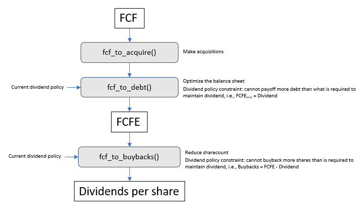
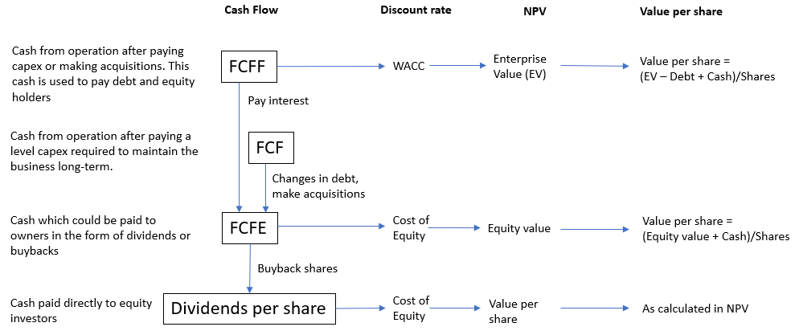

# Finagle project

This project contains a class, a notebook and an excel template. This class is used to model the financials of a publicly traded company. The notebook provides a convenient way to use the class and has various examples which may be modified as a starting point. The excel spreasheet is a template file which is used for creating a report for documentation and display purposes.   

## Company Class

The python module 'company.py' contains a class which allows modelling a company financially. With financial forecasts in various forms or levels of precision, one can input company financial foecasts. These can then form the basis for the calculation of free-cash flows (FCFE or FCFF, collectively referred to here FCF's). Once the FCF's have been calculated using the appropriate method, they can then be used for various purposes, specifically they can pay down debt, buyback shares, or even make an acquisition.

It has a number of methods which in general should be run in order once initialization of the company has occured:
- `forecast_X()`, to forecast financial data, where a forecast was not included in the financial dictionary.
- `load_financials()`, to load financial data into the company if it was not included during initialization.
- `fcf_from_X()`, there are several of these methods. They are all meant to be used for calculating fcf
- `fcf_to_X()`, these are methods which are used to model how the FCF is to be used: paying down debt, buying back shares
- `value()`, this method is use for calculating a DCF from the cashflows, This shold be run only once other methods described have been run
- `display_fin()`, this method is used to process the financials. It should be used once all modelling is completed

### How to install

Personally, I first clone the repo and then I do a local install of the package. To do this, from the project folder execute one of the following commands in a terminal.

```
allmypackages/
|--finagle/ <--execute command from here   
|  |--finagle
|  |  |--__init__.py
|  |  |--packagefiles.py
|  |--projectfiles.abc
|  |--setup.py
```

- PIP: ```pip install -e .``` 
- Anaconda: ```conda develop .``` (from a conda terminal)

That's just how I do it, you may have another way.

### Overview of the Cashflows 
The following digram shows some key funtional flows between inputs and methods to generate the various forecasts.


Effectively if none of the methods are called (and Debt is constant) then FCF = FCFE = Dividends and Buybacks = 0

These cashflows are the basis for the valuations caculated with the `value()` method

### Overview the valuation methods
Below is a figure which explains the various cashflows and values which are calculated using these cashflows.




### Treatment and interpretation of cash

It is well know that equity value is the NPV of the FCFE adjusted for the on-balancesheet cash. What is implicit in this definition is that the FCFE (and the current on balancesheet cash) is distributed to the investor in the period in which it is generated. Cash as forecast in the fin dataframe, is the cumulative FCFE over the course of the forecast period. So as it relates to the valuation, is not accumulated on the balance sheet. The one exception to this is the first column, for the baseline year (i.e. year 0), which is meant to be the cash on the balancesheet.

The effect of retaining cash on the balancesheet can be evaluated using the fcf_to_bs method. If this is used then the amount can be cash on the balancesheet can be observed using the cashBS in the fin dataframe. The effect of using this method on the valuation can be seen in the DDM model.

Because of these two points, 
1) Cash should never be negative, since this would imply that investors are paying-in capital in the form of a capital raise, which is not currently handled by the class. Since on-balancesheet cash is part of net-debt, requirements for cash should be handled by increasing debt.
2) Negative FCFE should be interpreted with caution (beyond year 1) of the forecast, since this would imply that investors are paying-in capital in the form of a capital raise. The exception to this could be year 1, which can offset up to the amount of cash which was on the balancesheet in year 0.
3) For cases with negative FCFE, it may be advisable to use the fcf_to_bs method.
4) if no cash is paid-out the terminal value of the Equity based calculation added to the terminal year dividend will equal the terminal value of the DDM model.

## Valuation notebook

The jupyter notebook 'Valuation notebook.ipynb' is a convenient way of using the company class. It contains various examples which can be modified for your own use. The examples make it fairly intuitive (I think), and can be self-interpreted so that you can use the class with little or no explanation.

## Company template 

The company template is a file which is called with the `xyz.display_fin()` method which is used to create a spreadsheet report

## Example

```
import company as cmp

#initializers
rd = 0.045
re = 0.10
t = 0.21
shares = 46 
gt = 0.02
roict=0.15 #mostly used for calculating terminal D&A
year = 10 #number of years to forescast; i.e. not including ttm (baseline) year

#company input data
financials = {
'date' : '2021-9-30',
'ebitda' : [881], #898 - stock based comp. only the ttm year, other years are calculated using the forecast_ebitda() method
'capex' :  [64,85],
'dwc' : [0,0,0,0,0,0,0,0,0,0,0],
'tax' : [192],
'da' : [79], #don't input for all years since the terminal year should be calculated from capex and ROIC
'debt' :  [758,758,758,758,765,765,765,765,765,765,765], 

'interest' : [33],
'cash' : 576,
'nol' : 0,
'noa' : 0,
}

ATKR = cmp.company(ticker = 'ATKR',rd = rd,re = re,t = t,shares = shares,gt = gt,roict = roict,year = year)
ATKR.forecast_ebitda(881,[-0.19,-0.15,0.10,0.10], financials) #only input 'organic' EBITDA
ATKR.forecast_capex(financials['capex'],financials)
ATKR.load_financials(financials = financials.copy())
ATKR.fcf_from_ebitda()
ATKR.fcf_to_acquire(year_a = 0, ebitda_frac = 0.008, multiple = 6.5, leverage = 0, gnext = 0.1, cap_frac = 0.12, adjust_cash = False)
ATKR.fcf_to_acquire(year_a = 1, ebitda_frac = 0.03, multiple = 6.5, leverage = 0, gnext = 0.1, cap_frac = 0.12, adjust_cash = False)
ATKR.fcf_to_acquire(year_a = 2, ebitda_frac = 0.1, multiple = 6.5, leverage = 0, gnext = 0.1, cap_frac = 0.12, adjust_cash = False)
ATKR.fcf_to_debt(leverage=2, year_d=3)
ATKR.fcf_to_buyback(price=120,dp = 'proportional')
ATKR.value()
ATKR.display_fin()
```


