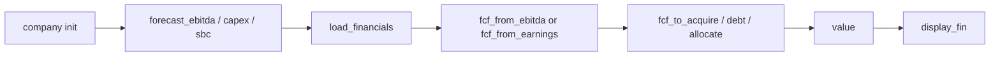
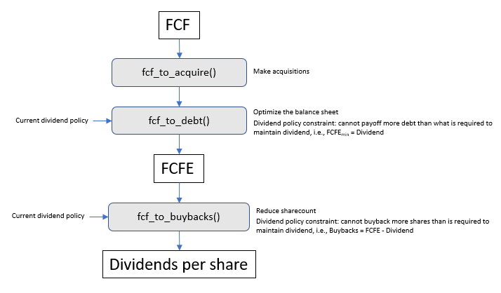
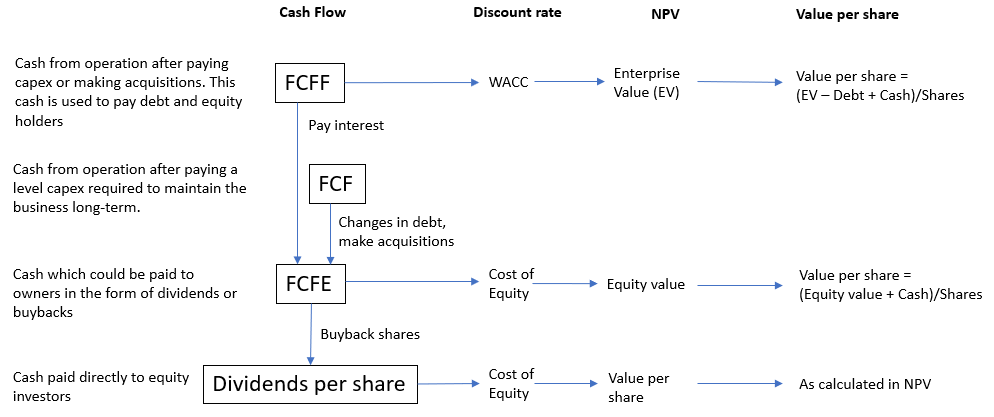

[](https://github.com/mtlr05/finagle/actions/workflows/python-app.yml)

# Finagle

Python package for modelling the financials of a publicly traded company: forecast operating results, derive free cash flows (FCF, FCFE, FCFF), allocate cash (debt paydown, buybacks, dividends, M&A, balance-sheet cash), and run DCF / dividend-discount valuations. Results can be exported to an Excel report via a template.

The package centers on the `company` class in `finagle/company.py`. Copy [`Valuation_template.ipynb`](Valuation_template.ipynb) into a local working folder to start a new company. Worked examples also live in `tests/Valuation notebook.ipynb` and the pytest suite.

## Repository contents

```
finagle/
├── finagle/
│   ├── __init__.py              # exports company
│   └── company.py               # company class
├── Valuation_template.ipynb     # copy into a local folder for a new ticker
├── company_template.xlsx        # display_fin() Excel template
├── FCF_distribution.PNG         # cashflow overview diagram
├── FCF_relations.png            # valuation / cashflow relations
├── tests/
│   ├── Valuation notebook.ipynb
│   ├── test_company.py
│   └── *.pkl                    # golden value() snapshots
├── setup.py
├── requirements.txt             # CI / dev dependencies
└── .github/workflows/python-app.yml
```

## Install

Clone the repo, then from the project root install in editable mode so `display_fin()` can resolve `company_template.xlsx` next to the package:

```bash
pip install -e .
```

Or with conda (from a conda terminal):

```bash
conda develop .
```

Runtime dependencies (from `setup.py`): `numpy`, `pandas`, `openpyxl`, `scipy`, `xlrd`. CI runs on Python **3.9.12**; `setup.py` does not currently declare `python_requires`.

For development / CI, `requirements.txt` also includes `pytest` and `flake8`.

## Quick start

Typical EBITDA-based path:

```
forecast_* → load_financials → fcf_from_ebitda → (optional fcf_to_*) → value → display_fin
```

```python
import finagle as cmp

financials = {
    'date': '2021-9-30',
    'ebitda': [881],
    'capex': [64, 90, 90, 90],
    'dwc': [0] + [0] * 10,
    'tax': [192],
    'da': [79, 79],
    'debt': [759] * 11,
    'interest': [33],
    'cash': 390.4,
    'nol': 0,
    'noa': 0,
}

c = cmp.company(
    ticker='ATKR', rd=0.05, re=0.09, t=0.21,
    shares=46, gt=0.02, roict=0.17, year=10, dividend=[0],
)
c.forecast_ebitda(881, [0.10, 0.05], financials)
c.forecast_capex(financials['capex'], financials)
c.load_financials(financials=financials.copy())
c.fcf_from_ebitda()
c.fcf_to_debt(leverage=2, year_d=3)
c.fcf_to_allocate(price=113, dp='constant', buybacks=[0.0, 500, 500])
c.value()
c.display_fin()  # writes ATKR.xlsx
```

See [Example](#example) for a full ATKR case with acquisitions. For a new company, copy [`Valuation_template.ipynb`](Valuation_template.ipynb) into a local working folder. `tests/Valuation notebook.ipynb` has additional scenarios.

## Typical workflow

Methods should generally be run in this order:

1. `company(...)` — optionally pass `financials` to load immediately
2. `forecast_ebitda` / `forecast_capex` / `forecast_sbc` — store series on the instance **before** load when forecasts are incomplete. The caller's dict is left unchanged; `load_financials` overlays those stored series.
3. `load_financials` — if not loaded in `__init__`
4. `fcf_from_ebitda` **or** `fcf_from_earnings` (or pass `fcfe` / `fcff` / `fcf` into the constructor for a direct DCF)
5. Optional capital actions (many re-call `fcf_from_ebitda`): `fcf_to_acquire`, `fcf_to_debt`, `noa_to_dispose`, then `fcf_to_allocate` / `fcf_to_buyback` / `fcf_to_bs`
6. `value()` once FCF and allocation decisions are final
7. `display_fin()` last, for the Excel report


```mermaid
flowchart LR
  init[company init]
  forecast[forecast_ebitda / capex / sbc]
  load[load_financials]
  fcf[fcf_from_ebitda or fcf_from_earnings]
  allocate[fcf_to_acquire / debt / allocate]
  value[value]
  display[display_fin]
  init --> forecast --> load --> fcf --> allocate --> value --> display
```

If none of the allocation methods are called (and debt is constant), then FCF = FCFE and dividends / buybacks remain at policy defaults (often zero beyond year 0).

## Constructor reference

```python
company(
    financials=None, ticker=None, re=None, rd=None, t=None, te=None,
    shares=1, price=0, gt=0, fcfe=None, fcff=None, fcf=None,
    roict=0.15, year=6, dividend=0,
)
```

| Parameter | Default | Purpose |
|-----------|---------|---------|
| `financials` | `None` | Dict of financial inputs; if provided, calls `load_financials()` immediately |
| `ticker` | `None` | Ticker symbol; used for `{ticker}.log` and `{ticker}.xlsx` |
| `re` | `None` | Cost of equity |
| `rd` | `None` | Cost of debt |
| `t` | `None` | Marginal tax rate |
| `te` | `None` | Effective tax rate for year 1; if `None`, derived in `fcf_from_ebitda` |
| `shares` | `1` | Shares outstanding (all classes) |
| `price` | `0` | Current share price |
| `gt` | `0` | Terminal growth rate |
| `fcfe` / `fcff` / `fcf` | `None` | Optional direct cash-flow series for DCF without a full build |
| `roict` | `0.15` | Terminal ROIC; used mainly for terminal depreciation |
| `year` | `6` | Final forecast year (year before terminal) |
| `dividend` | `0` | Current dividend policy (`float`/`int` or `list`) |

Side effects: logging to `{ticker}.log`; `self.years = list(range(year + 1))`.

Import: `import finagle as cmp` then `cmp.company(...)` (the package exports only the `company` class).

## `financials` dict schema

Each value may be a scalar or a list. Index 0 is the trailing-twelve-months (TTM) / baseline year. `date` must be a string in `'%Y-%m-%d'` form; `load_financials` expands it to annual dates for the horizon.

### Core keys

| Key | Role | Typical length |
|-----|------|----------------|
| `date` | Last reporting date | 1 |
| `ebitda` | EBITDA | 1 or full horizon |
| `capex` | Capital expenditure | 1 or full horizon |
| `dwc` | Change in non-cash working capital | full horizon |
| `tax` | TTM reported taxes | 1 |
| `da` | TTM depreciation & amortization | 1 (later years often calculated) |
| `debt` | Short + long-term debt | full horizon |
| `cash` | Excess cash / short-term investments | 1 |
| `nol` | Net operating losses | 1 |
| `noa` | Non-operating assets | 1 |

### Also required for the EBITDA path

| Key | Notes |
|-----|--------|
| `interest` | Year-0 interest kept; later years from `rd * prior debt` |
| `sbc` | Stock-based compensation; must be complete (non-NaN) for datacheck |
| `revenue` | Must exist as a column; often filled by `forecast_ebitda` |

### Other paths and auto-added columns

- **Earnings path:** provide `e` (earnings) for `fcf_from_earnings`.
- **Auto-added on load:** `shares`, `price`, `MnA`, `buybacks`, `cashBS`.

If `ebitda` is present, missing required columns or NaNs in `ebitda`, `capex`, `dwc`, `debt`, or `sbc` raise `ValueError` at load and name the problem. Extra keys are ignored. A dict with no `ebitda` column (direct FCFE, or earnings via `e`) is not held to the EBITDA column list.

## Method reference

### Forecast

#### `forecast_ebitda(ebitda_ttm, gf, financials=None, me=None, mc=None, gsnext=None)`

Build a multi-year EBITDA forecast (and optionally revenue). Growth rates `gf` (float or list) are interpolated to terminal growth `gt`. If `me`, `mc`, and `gsnext` are all set, later years use a margin / sales-growth path; otherwise EBITDA compounds by growth and `revenue` is filled with `0`. When `financials` is passed, the series are stored on the instance for `load_financials`. The caller's dict is not modified. `financials=None` (used internally for acquisition EBITDA) only returns the list.

#### `forecast_capex(capex_f, financials)`

Extend a partial capex forecast by holding the last known capex/EBITDA ratio for remaining years. EBITDA comes from a stored `forecast_ebitda` result when that exists, otherwise from `financials['ebitda']`. The completed capex series is stored on the instance.

#### `forecast_sbc(sbc_f, financials, sbc_rate_t=None)`

Forecast stock-based compensation as a fraction of EBITDA. Partial forecasts are extended by interpolating toward `sbc_rate_t`, or by holding the last year's ratio if `sbc_rate_t` is `None`. The completed series is stored on the instance.

### Load

#### `load_financials(financials)`

Copy the `financials` dict, overlay any series stored by `forecast_*`, and convert that into `self.fin` (date-indexed DataFrame). Initialize `MnA` / `buybacks` / `cashBS`, copy year-0 cash into `cashBS` and `self.cash0`, and run the datacheck. Call after `forecast_*`, unless `financials` was passed to `__init__`. Later capital-action calls are recorded and replayed from this loaded snapshot in a fixed order: free cash flow, acquisitions, disposals, debt target, then one distribution method.

### Build free cash flow

#### `fcf_from_earnings(payout=1, gf=0, ROE=1)`

Grow earnings (`e`) and set `fcfe = e * payout`. Terminal payout is `1 - gt/ROE`. Requires `data_for_earnings`.

#### `fcf_from_ebitda()`

Full EBITDA → interest / DA / tax / NOL → `fcf` / `fcfe` / `fcff` pipeline. Creates or updates many `fin` columns (`interest`, `da`, `income_pretax`, `tax`, `tax_cash`, `dividend_policy`, cumulative `cash`, etc.). Often re-called by debt, acquisition, and disposal methods. Requires `data_for_ebitda`.

### Capital allocation

#### `fcf_to_debt(leverage=3, year_d=1)`

Path debt toward a Debt/EBITDA target starting at `year_d`, constrained by available FCF/cash when delevering. Re-runs `fcf_from_ebitda()` for interest/FCF convergence. Prerequisite: FCF already calculated.

#### `fcf_to_bs()`

Accumulate undistributed FCFE on `cashBS`, pay dividends per `dividend_policy`, and distribute remaining cash as a terminal dividend. Sets `self.cash0 = 0` so year-0 cash is not double-counted in the DDM. Called automatically by `fcf_to_allocate`.

#### `fcf_to_buyback(price, dp='proportional')`

Use FCFE (minus dividend policy) for buybacks; reduce share count; update the price path. `dp` controls price evolution (see below). Sets `self.cash0 = 0` and `self.buybacks = True`.

#### `fcf_to_allocate(price, dp='proportional', buybacks=None)`

General cash allocation. `buybacks=None` buys back as much as possible via `fcf_to_buyback`; otherwise a fixed buyback schedule (list/float/int) is applied and remaining cash goes to the balance sheet via `fcf_to_bs`.

#### `fcf_to_acquire(adjust_cash, year_a=1, ebitda_frac=0.1, multiple=10, leverage=3, gnext=0.1, cap_frac=0.2)`

Model an acquisition: lift EBITDA, add debt (`leverage *` acquired EBITDA), record cash outlay in `MnA` at `multiple *` acquired EBITDA, add capex as `cap_frac` of incremental EBITDA, then recalculate FCF. If `adjust_cash` is `True` and `year_a == 0`, year-0 cash is reduced by the equity portion of the purchase. Returns the incremental EBITDA series.

#### `noa_to_dispose(dnoa, tax=0, year_dis=1)`

Dispose of non-operating assets: reduce `noa` and credit `MnA` by `-dnoa * (1 - tax)` (cash inflow), then recalculate FCF.

### Share-price path (`dp`)

Used by `fcf_to_buyback` and `fcf_to_allocate`:

| Value | Meaning |
|-------|---------|
| `'proportional'` (default) | Hold forward EV/EBITDA multiple vs year 1; update price each year |
| `'constant'` | Keep share price constant at the provided `price` |

### Valuation and report

#### `value()`

Discount FCFE (equity), FCFF (firm), and dividends (DDM). Sets `equity`, `firm`, `DDM`, `value_per_share`, `value_per_share_DDM`, `EV` / `wacc`, and optionally `vpsbb` if buybacks were used. Returns `(self.fin['equity'], self.fin['firm'])`. On the earnings-only path, firm value is `None`. Run **after** all FCF and allocation steps.

#### `display_fin()`

Build a styled summary table and write `{ticker}.xlsx` from `company_template.xlsx` (repo root). Run last, after `value()`.

## Overview of the cashflows

The following diagram shows key functional flows between inputs and methods to generate the various forecasts.



Effectively if none of the allocation methods are called (and debt is constant) then FCF = FCFE = Dividends and Buybacks = 0.

These cashflows are the basis for the valuations calculated with the `value()` method.

## Overview of the valuation methods

Below is a figure which explains the various cashflows and values which are calculated using these cashflows.



A valuation based on FCFE discounts these cashflows to present from the period in which they are generated. If additional precision is desired, one can allocate the FCFE: cash can be used for buybacks, dividends, or stored on the balance sheet. This is done using `fcf_to_allocate()` (or alternatively `fcf_to_buyback()` or `fcf_to_bs()`). If one of these methods is invoked, the valuation provided by the dividend discount model (`value_per_share_DDM`) will differ from the basic discounted FCFE model (`value_per_share`) as provided in the Excel report.

## Treatment and interpretation of cash

It is well known that equity value is the NPV of the FCFE adjusted for on-balance-sheet cash. What is implicit in this definition is that the FCFE (and the current on-balance-sheet cash) is distributed to the investor in the period in which it is generated. Cash as forecast in the `fin` dataframe is the cumulative FCFE over the course of the forecast period, so as it relates to the valuation it is not accumulated on the balance sheet. The one exception is the first column, for the baseline year (year 0), which is meant to be the cash on the balance sheet. In the case of the DDM, any cash accumulated on the balance sheet is distributed in the final year of the forecast in the form of a dividend. Terminal equity values used in both methods are the same, though per-share values will differ if buybacks reduced the share count. If no allocation method is invoked, the DDM and FCFE models will give the same results.

The effect of retaining cash on the balance sheet can be evaluated using `fcf_to_bs`. The amount of cash on the balance sheet can be observed using `cashBS` in the `fin` dataframe. The effect of using this method on the valuation can be seen in the DDM model.

Because of these points:

1. Cash should never be negative, since this would imply that investors are paying in capital in the form of a capital raise, which is not currently handled by the class. Since on-balance-sheet cash is part of net debt, requirements for cash should be handled by increasing debt.
2. Negative FCFE should be interpreted with caution (beyond year 1) of the forecast, since this would imply that investors are paying in capital. The exception can be year 1, which can offset up to the amount of cash which was on the balance sheet in year 0.
3. For cases with negative FCFE, it may be advisable to use the `fcf_to_bs` method.
4. The terminal value of the equity-based approach is equal to the terminal value of the DDM model times the share count.

## Outputs

### `self.fin` DataFrame

After a full EBITDA run plus `value()`, key columns include those exported by `display_fin()`:

`revenue`, `ebitda`, `sbc`, `da`, `interest`, `income_pretax`, `nol`, `income_taxable`, `tax_cash`, `tax`, `capex`, `MnA`, `dDebt`, `dwc`, `fcf`, `fcfe`, `fcff`, `buybacks`, `dividend`, `cash`, `cashBS`, `noa`, `equity`, `debt`, `EV`, `wacc`, `firm`, `shares`, `price`, `value_per_share`, `value_per_share_DDM`.

### Return values and files

| Output | Description |
|--------|-------------|
| `value()` return | `(equity, firm)` series on `self.fin` |
| `{ticker}.xlsx` | Excel report from `company_template.xlsx` |
| `{ticker}.log` | Run log written during modelling |

## Valuation notebook and worked examples

[`Valuation_template.ipynb`](Valuation_template.ipynb) is the starting point for a new company. Copy it into a local working folder, rename it to the ticker, and run it there. `{ticker}.xlsx` and `{ticker}.log` are written in that folder. The notebook lists every public method and where it belongs in the workflow.

[`tests/Valuation notebook.ipynb`](tests/Valuation%20notebook.ipynb) contains sample problems that can be modified as further examples.

The pytest suite mirrors several of those paths (golden `.pkl` comparisons of `value()` results):

| Scenario | Test / focus | Key methods |
|----------|--------------|-------------|
| Direct FCFE DCF | `test_value` | constructor `fcfe=...`, `value()` |
| Earnings / payout model | `test_fcf_from_earnings` | `fcf_from_earnings`, `value()` |
| Full EBITDA + debt + buybacks | `test_fcf_from_ebitda` | `fcf_from_ebitda`, `fcf_to_debt`, `fcf_to_buyback` |
| Forecast then load | `test_forecast_ebitda` | `forecast_ebitda`, `load_financials`, … |
| Acquisition | `test_fcf_to_acquire` | `fcf_to_acquire` |
| Allocate + SBC | `test_fcf_to_allocate` | `forecast_sbc`, `fcf_to_allocate` |

## Company template

[`company_template.xlsx`](company_template.xlsx) at the repo root is filled by `display_fin()`. The method writes a `{ticker}.xlsx` workbook (raw data + report sheets) beside the process working directory. Editable install from a clone is expected so the template path (`../company_template.xlsx` relative to `finagle/company.py`) resolves correctly.

## Development and tests

From the repo root:

```bash
pip install -r requirements.txt -e .
pytest
```

CI (`.github/workflows/python-app.yml`) runs on pushes and pull requests to `main` using Python 3.9.12 and `pytest`. Tests compare `value()` outputs to pickled snapshots under `tests/`.

## Known limitations

- Equity issuance / capital raises are not modelled; avoid negative cash, and treat negative FCFE after year 1 with caution (see cash section above).
- An EBITDA case with missing columns or NaNs in the forecast series raises `ValueError` at load. Direct FCFE and earnings-only cases are not checked against the EBITDA column list.
- Terminal depreciation can log an error if capex / ROIC / growth imply negative terminal DA.
- `display_fin()` loads the template with a Windows-style path relative to the package and expects the repo layout (template at project root).
- Acquisitions that drive cash below zero log an error; lower EBITDA or raise leverage as needed.

## Example

```python
import finagle as cmp

# ATKR post fy22 Q2
# full ebitda based calculation, using forecast_ebitda() and load_financials()
# buybacks at $113 pps

# initializers
rd = 0.05
re = 0.09
t = 0.21
shares = 46  # sharecount at the beginning of 2022, currently closer to 43
gt = 0.02
roict = 0.17  # this could be quite high if there is significant uncapitalized R&D
year = 10  # number of years to forecast; i.e. not including ttm (baseline) year

# company input data
financials = {
    'date': '2021-9-30',
    'ebitda': [881],  # 898 - stock based comp. only the ttm year; other years via forecast_ebitda()
    'capex': [64, 90, 90, 90],
    'dwc': [0, 448.5, 0, 0, 0, 0, 0, 0, 0, 0, 0],  # removed half of the FCF by adjusting WC since were in Q2
    'tax': [192],
    'da': [79, 79],  # don't input for all years since the terminal year should be calculated from capex and ROIC
    'debt': [759, 759, 759, 759, 759, 759, 759, 759, 759, 759, 759],
    'interest': [33],
    'cash': 390.4,
    'nol': 0,
    'noa': 0,
}

ATKR = cmp.company(ticker='ATKR', rd=rd, re=re, t=t, shares=shares, gt=gt, roict=roict, year=year, dividend=[0])
# ATKR.forecast_ebitda(881, [0.4756, -0.3176, -0.1911, 0.10], financials)  # only organic EBITDA
ATKR.forecast_ebitda(881, [0.4756, -0.3233, -0.3096, 0.10], financials)  # only organic EBITDA
ATKR.forecast_capex(financials['capex'], financials)
ATKR.load_financials(financials=financials.copy())
ATKR.fcf_from_ebitda()
ATKR.fcf_to_acquire(year_a=1, ebitda_frac=0.0157, multiple=6.5, leverage=0, gnext=0.1, cap_frac=0.12, adjust_cash=False)
ATKR.fcf_to_acquire(year_a=2, ebitda_frac=0.0227, multiple=6.5, leverage=0, gnext=0.1, cap_frac=0.12, adjust_cash=False)
ATKR.fcf_to_acquire(year_a=3, ebitda_frac=0.0315, multiple=6.5, leverage=0, gnext=0.1, cap_frac=0.12, adjust_cash=False)
ATKR.fcf_to_acquire(year_a=4, ebitda_frac=0.03, multiple=6.5, leverage=0, gnext=0.1, cap_frac=0.12, adjust_cash=False)
ATKR.fcf_to_acquire(year_a=5, ebitda_frac=0.03, multiple=6.5, leverage=0, gnext=0.1, cap_frac=0.12, adjust_cash=False)
ATKR.fcf_to_acquire(year_a=6, ebitda_frac=0.03, multiple=6.5, leverage=0, gnext=0.1, cap_frac=0.12, adjust_cash=False)
ATKR.fcf_to_acquire(year_a=7, ebitda_frac=0.03, multiple=6.5, leverage=0, gnext=0.1, cap_frac=0.12, adjust_cash=False)
ATKR.fcf_to_acquire(year_a=8, ebitda_frac=0.03, multiple=6.5, leverage=0, gnext=0.1, cap_frac=0.12, adjust_cash=False)
ATKR.fcf_to_acquire(year_a=9, ebitda_frac=0.03, multiple=6.5, leverage=0, gnext=0.1, cap_frac=0.12, adjust_cash=False)
ATKR.fcf_to_debt(leverage=2, year_d=3)
ATKR.fcf_to_allocate(price=113, dp='constant', buybacks=[0.0, 500, 500, 500, 0])
ATKR.value()
ATKR.display_fin()
```
